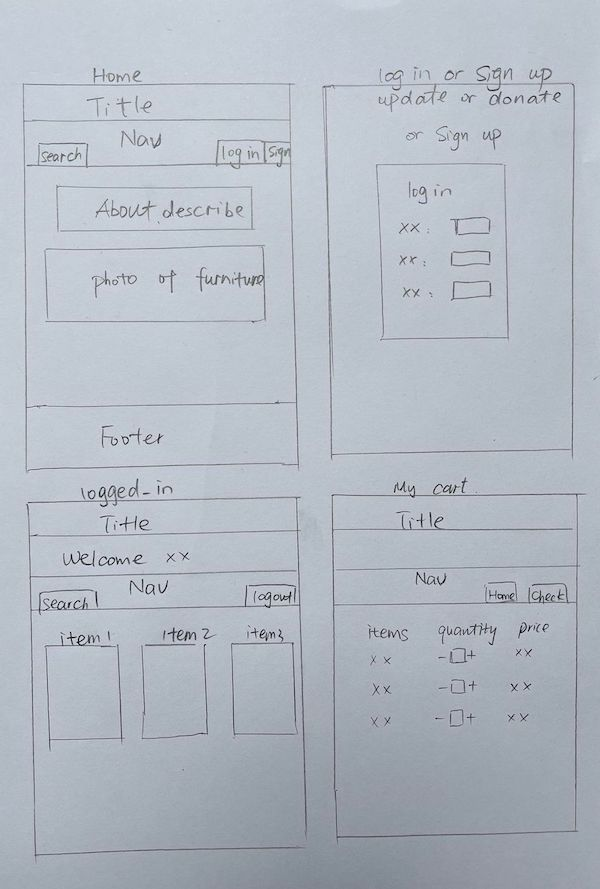

# LUCKY Furniture Market
  

## :computer: [Click here](https://fathomless-fortress-15915.herokuapp.com/) to see my live project!

## :page_facing_up: About
- It's a online shopping and donating webside for second-hand furniture store.
- Every guest can visit the website and donate their pre-loved furnitures.
- Only logged-in guest can update, delete and buy furnitures. 

## :pencil2: Planning & Problem Solving
- design a shopping website with CRUD, 
- think about logic, users can buy furnitures while stadd can update, add and delete furnitures
- design users and staff logic, login, signup staff login
- design website layout
- design database --- users information, furnitures, carts

## :rocket: Cool tech
- Ruby, CSS, HTML
- Sinatra
- Heroku
- API

## :scream: Bugs to fix :poop:
- The quantity of furniture can be drop below 0.
- If the number of added cart furniture can not be seen on the page, then the update and donate funtion disabled. 

## :sob: Lessons learnt
- a rough database should be designed before everything setup
- login, sign up, donate pages have almost the same layout, I make them sharing the same CSS code

## :white_check_mark: Future features
- will get accesss to data from shopping carts by user_id, not user_name
- add online enquiry function
